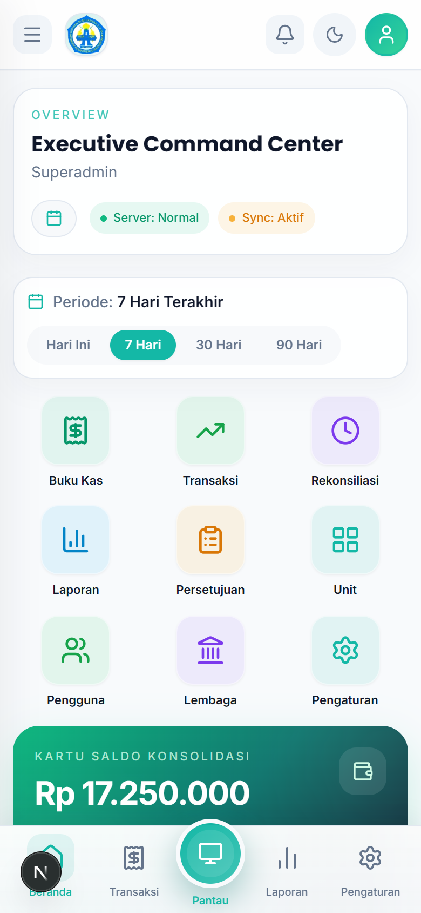
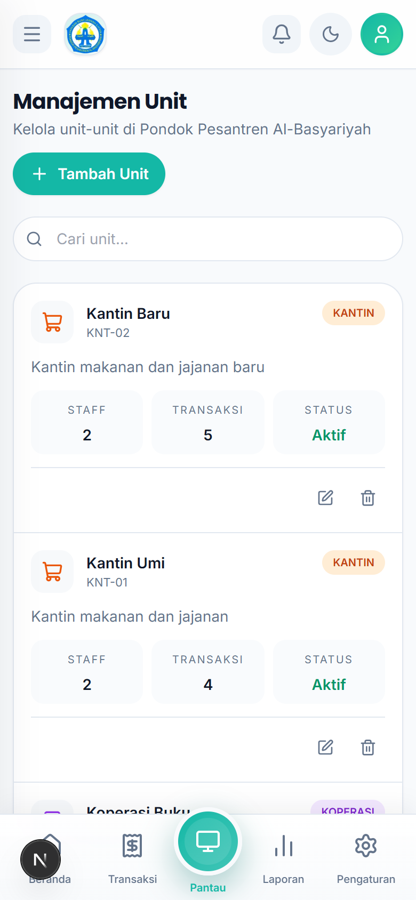
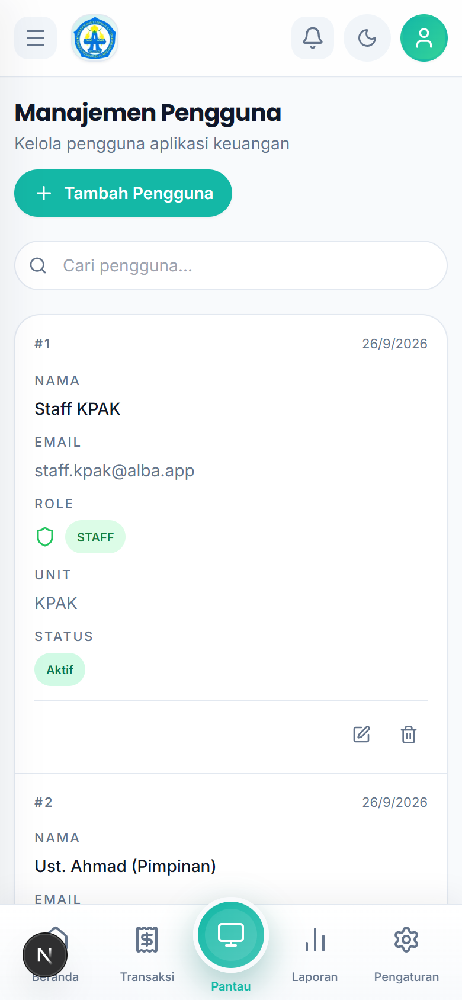
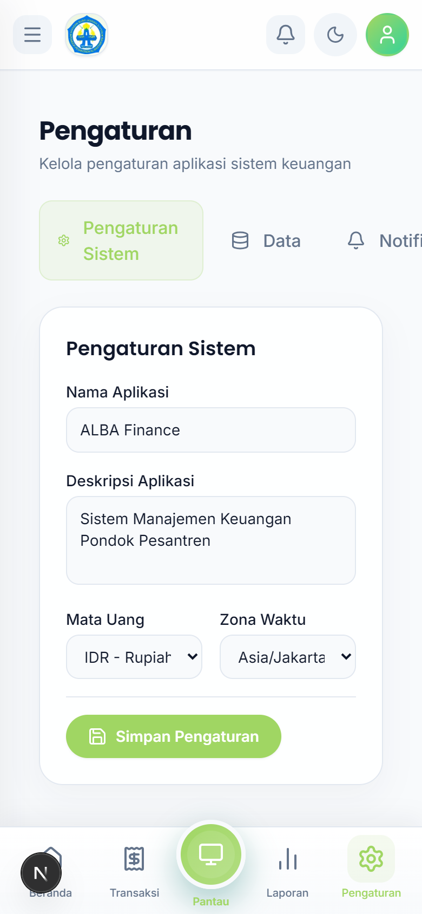

# Panduan SUPERADMIN

SUPERADMIN memegang akses penuh: semua menu, semua unit, pengaturan sistem, dan manajemen pengguna.

## 1. Dashboard

Ringkasan kondisi keuangan dan menu navigasi lengkap di sidebar (Keuangan, Toko, Data KPAK, Layanan KPAK, Sistem).

## 2. Kelola Unit (`Sistem → Unit`)

Melihat daftar unit (KPAK, Koperasi Buku, Kantin Umi, Kantin Baru), menambah unit baru, dan mengatur detail unit.

Langkah menambah unit:

1. Buka `Sistem → Unit`.
2. Klik tambah unit, isi nama, kode, dan tipe unit (KPAK/retail).
3. Simpan. Unit baru langsung bisa dipilih saat membuat akun pengguna.

## 3. Kelola Pengguna (`Sistem → Pengguna`)

Membuat akun untuk PIMPINAN, MANAGER, dan STAFF, mengatur peran + unit, menonaktifkan akun yang sudah tidak bertugas, dan me-reset password.

Langkah membuat pengguna:

1. Buka `Sistem → Pengguna`.
2. Klik tambah pengguna, isi nama, email, password awal, peran, dan unit (untuk MANAGER/STAFF).
3. Simpan dan beritahukan email + password awal ke pengguna.

## 4. Pengaturan (`Sistem → Pengaturan`)

Mengatur identitas aplikasi dan **tema tampilan** (warna primer, mode terang/gelap). Perubahan tersimpan dan berlaku untuk semua pengguna.

## 5. Menu Lain yang Sering Dipakai

- **Papan Pantau** — pantauan live seluruh aktivitas.
- **Pengumuman** — kirim pengumuman ke pengguna.
- **Buku Kas** — melihat semua transaksi semua unit.
- **Pengajuan** — daftar pengajuan yang butuh persetujuan.
- **Rekonsiliasi** — pencocokan kas antar catatan.
- **Serah Terima Kas** — berita acara serah terima kas.
- **Lembaga** — data lembaga pesantren.

## Tips

- Satu-satunya peran yang boleh membuka menu **Sistem**. Jaga akun ini baik-baik.
- Buatkan akun sesuai peran (jangan semua pakai SUPERADMIN) agar jejak aktivitas jelas.
