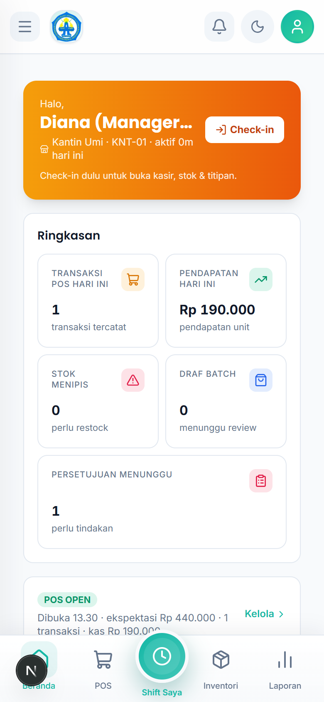
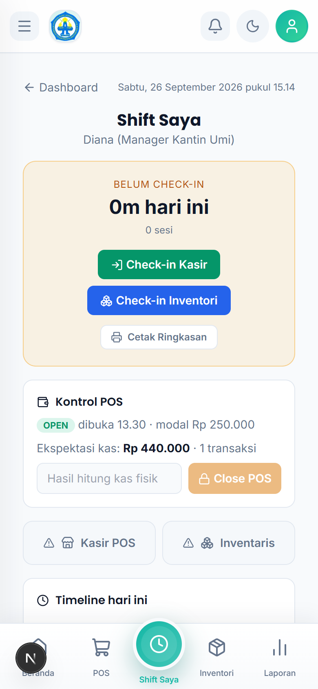
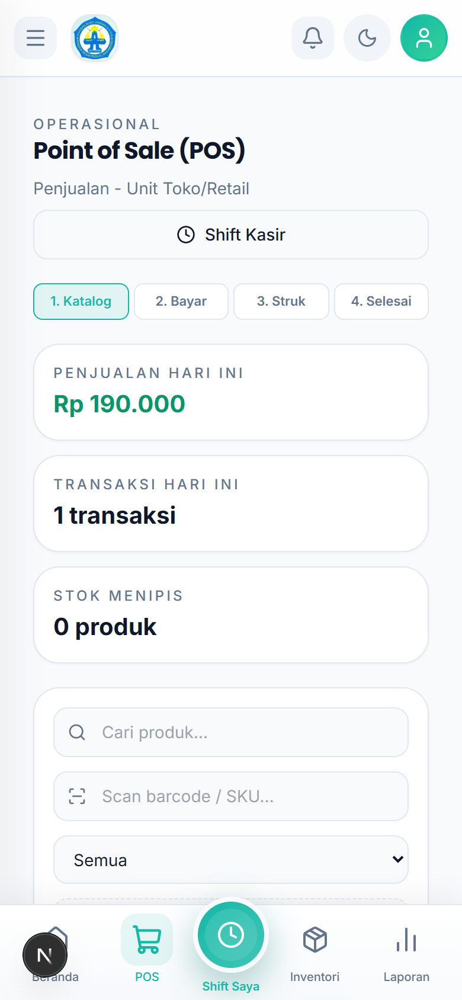
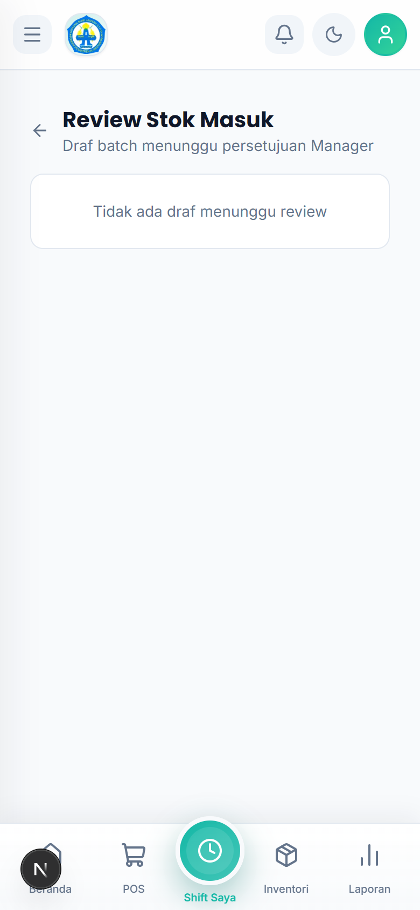
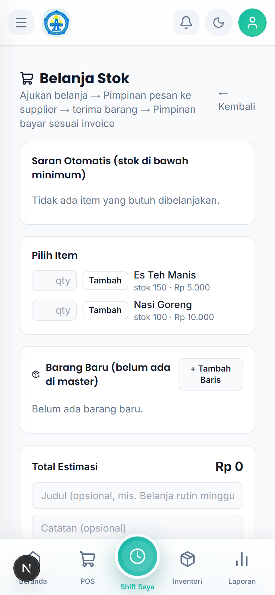
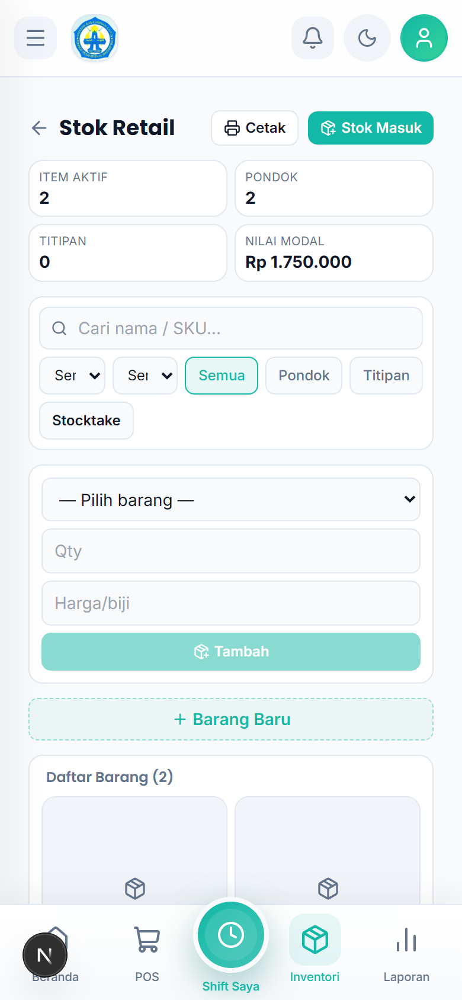

# Tutorial — Manager Kantin Umi

Akun: `manager.kantinumi@alba.app` / `bismillah`

## 1. Cara Login

1. Buka aplikasi di browser HP.
2. Isi **Email** `manager.kantinumi@alba.app` dan **Password** `bismillah`.
3. Ketuk **Masuk**.

## 2. Membaca Dashboard (Pusat Kerja)

Ringkasan jualan Kantin Umi + badge antrean: **Review Stok Masuk**, **Hitung Sisa**, **Pengajuan**.

## 3. Shift Saya

1. Buka `Kerja Harian → Shift Saya`.
2. Mulai shift (check-in), pantau kru, check-out di akhir.

## 4. Melayani di POS (bila dibutuhkan)

1. Buka `Kerja Harian → POS`, pastikan **Shift Kasir** terbuka.
2. Ikuti 4 langkah: **Katalog → Bayar → Struk → Selesai**.

## 5. Mereview Stok Masuk (wajib harian)

1. Buka `Kerja Harian → Review Stok Masuk`.
2. Ketuk batch draf → periksa rincian.
3. **Setujui** (konfirmasi "Setujui batch? Stok akan bertambah") atau **Tolak** dengan catatan wajib.

## 6. Belanja Stok

1. Buka `Kelola → Belanja Stok`.
2. Tambah barang (**Tambah** / **+ Tambah Baris**), isi judul + catatan.
3. Ketuk **Ajukan Belanja** (ke Pimpinan).
4. Setelah barang datang + invoice ada: **Bayar & Catat Transaksi**.

## 7. Memeriksa Inventori

1. Buka `Kelola → Inventori` untuk stok Kantin Umi.

## 8. Rutinitas Harian

1. **Shift Saya** → mulai shift.
2. **Review Stok Masuk** → nolkan draf.
3. **Hitung Sisa** → setujui hitungan staff.
4. Tutup shift.
