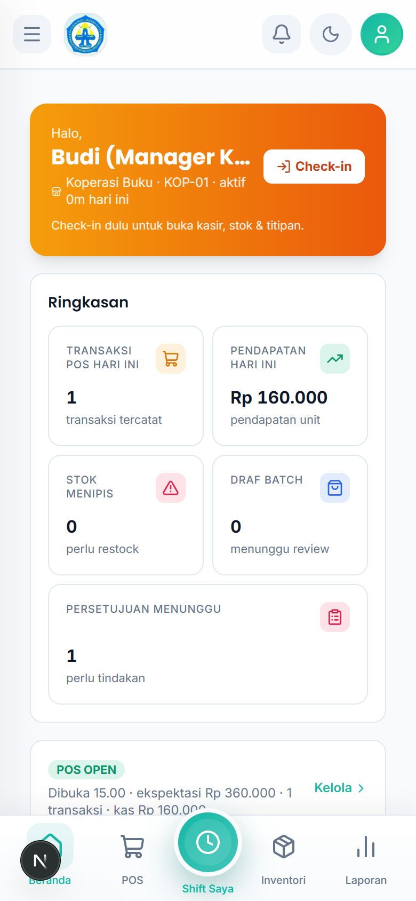
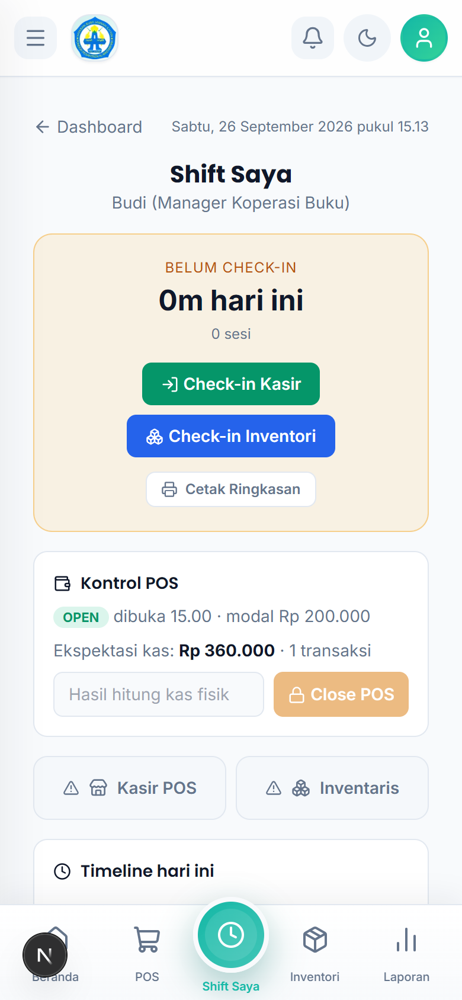
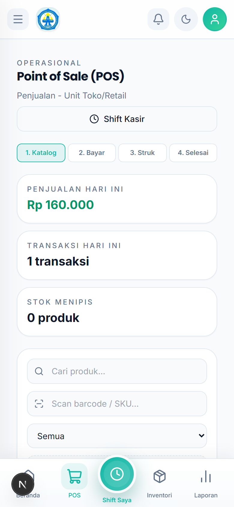
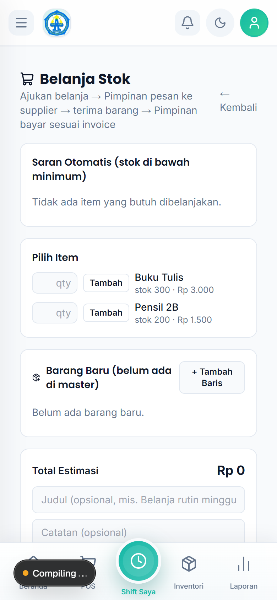
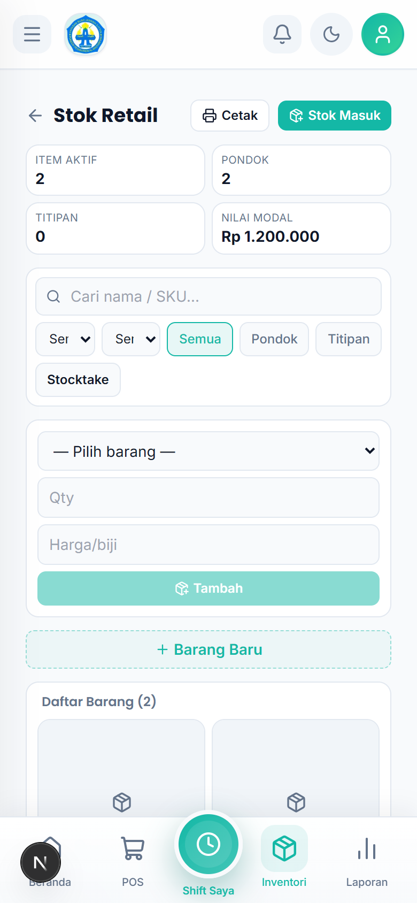

# Tutorial — Manager Koperasi Buku

Akun: `manager.koperasi@alba.app` / `bismillah`

## 1. Cara Login

1. Buka aplikasi di browser HP.
2. Isi **Email** `manager.koperasi@alba.app` dan **Password** `bismillah`.
3. Ketuk **Masuk**.

## 2. Membaca Dashboard (Pusat Kerja)

Ringkasan jualan + badge antrean: **Review Stok Masuk**, **Hitung Sisa**, **Pengajuan**.

## 3. Shift Saya

1. Buka `Kerja Harian → Shift Saya`.
2. Mulai shift (check-in) di awal tugas, pantau kru, dan check-out di akhir.

## 4. Melayani di POS (bila dibutuhkan)

1. Buka `Kerja Harian → POS`.
2. Pastikan **Shift Kasir** terbuka (isi modal/kas awal bila diminta).
3. Ikuti 4 langkah: **Katalog → Bayar → Struk → Selesai**.

## 5. Mereview Stok Masuk (wajib harian)

1. Buka `Kerja Harian → Review Stok Masuk` (badge = draf menunggu).
2. Ketuk satu batch (nomor batch) untuk melihat rincian barang.
3. Untuk menyetujui: ketuk **Setujui** → konfirmasi "Setujui batch? Stok akan bertambah".
4. Untuk menolak: isi **Catatan review** (wajib) → ketuk **Tolak**. Staff memperbaiki inputnya.

## 6. Belanja Stok

1. Buka `Kelola → Belanja Stok`.
2. Tambah barang ke keranjang (**Tambah** / **+ Tambah Baris**), isi judul dan catatan.
3. Ketuk **Ajukan Belanja** (terkirim ke Pimpinan).
4. Alur: Pimpinan pesan ke supplier → barang diterima → lunasi via **Bayar & Catat Transaksi** (isi No. Invoice + Total Final).

## 7. Memeriksa Inventori

1. Buka `Kelola → Inventori` untuk daftar persediaan dan level stok.

## 8. Rutinitas Harian

1. **Shift Saya** → mulai shift.
2. **Review Stok Masuk** → nolkan draf batch.
3. **Hitung Sisa** → setujui hitungan staff.
4. **Pengajuan** → ajukan kebutuhan / pantau status.
5. Tutup shift.
