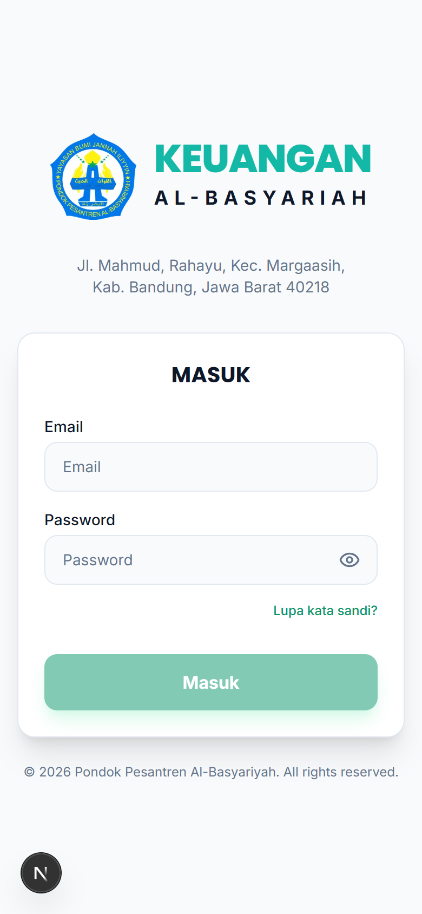
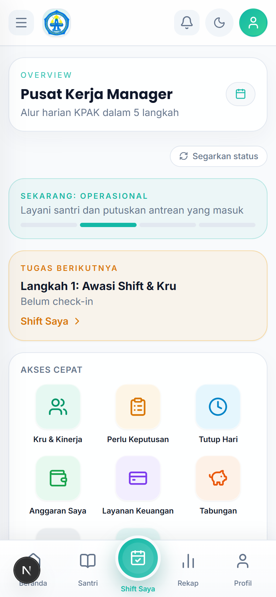
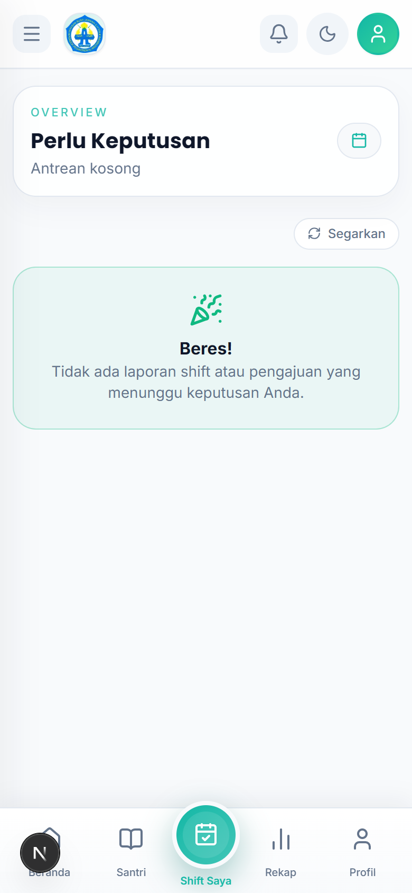
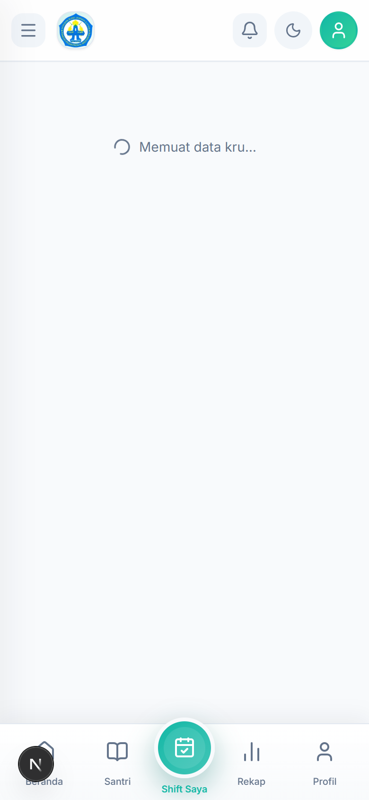
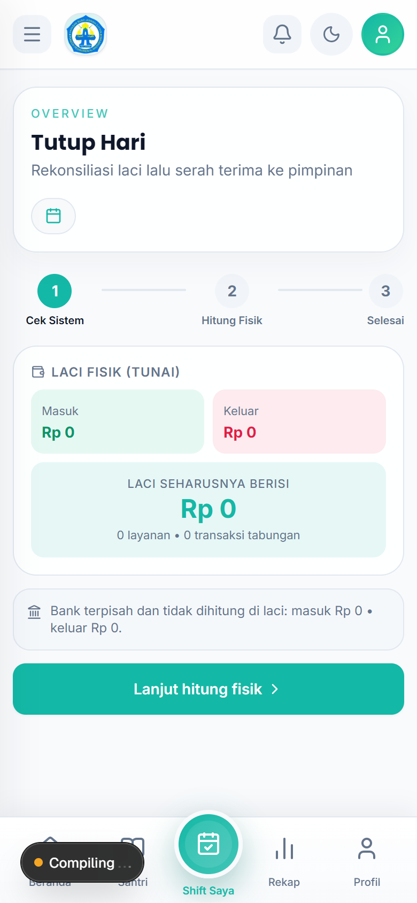
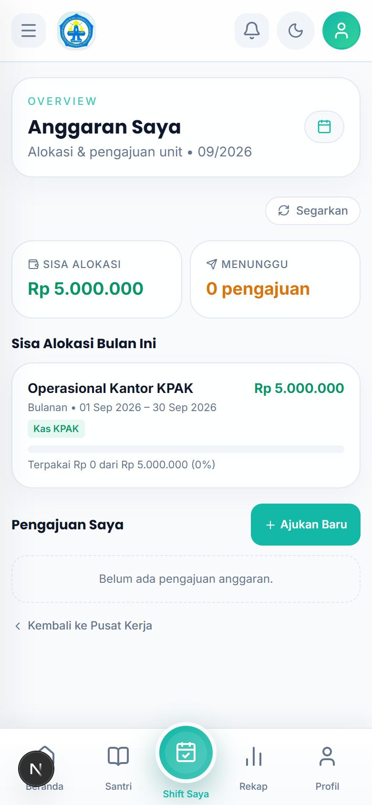

# Tutorial — Manager KPAK

Akun: `manager.kpak@alba.app` / `bismillah`

## 1. Cara Login

1. Buka aplikasi di browser HP.
2. Isi **Email** `manager.kpak@alba.app` dan **Password** `bismillah`.
3. Ketuk **Masuk**.

## 2. Membuka Pusat Kerja

1. Setelah login, buka `Kerja Harian → Pusat Kerja`.
2. Ikuti **5 langkah alur harian** dan kerjakan **Tugas berikutnya** yang ditampilkan.

## 3. Memutuskan Hal yang Menunggu (Perlu Keputusan)

1. Buka `Kerja Harian → Perlu Keputusan`.
2. Ada dua jenis antrean:
   - **Laporan Shift Kru** — baca lalu ketuk **Terima Laporan**.
   - **Pengajuan transaksi** — ketuk **Setujui** atau **Tolak**.

## 4. Mengawasi Kru (Kru & Kinerja)

1. Buka `Kerja Harian → Kru & Kinerja`.
2. Lakukan **Check-in General** (pengawasan) di awal hari.
3. Pantau siapa yang sedang bertugas (badge angka = kru aktif).

## 5. Menutup Hari (Tutup Hari)

1. Buka `Kerja Harian → Tutup Hari` di akhir operasional.
2. **Langkah 1** — catat laci fisik (tunai), ketuk **Lanjut hitung fisik**.
3. **Langkah 2** — isi **Uang fisik di laci saat ini**, cocokkan dengan sistem (Pas / Selisih).
4. Ketuk **Tutup Hari Ini** (ketuk dua kali sebagai konfirmasi).
5. Serah terima otomatis dibuat untuk pimpinan. Cetak **Berita Acara** bila perlu.

## 6. Memantau Anggaran Saya

1. Buka `Kelola → Anggaran Saya`.
2. Lihat pagu vs realisasi anggaran unit KPAK.

## 7. Rutinitas Harian

1. **Pusat Kerja** → kerjakan Tugas berikutnya.
2. **Kru & Kinerja** → check-in general + pantau kru.
3. **Perlu Keputusan** → nolkan antrean (terima/setujui/tolak).
4. **Tutup Hari** → tutup dan serah terima ke pimpinan.
