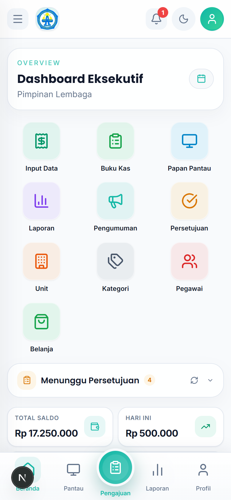
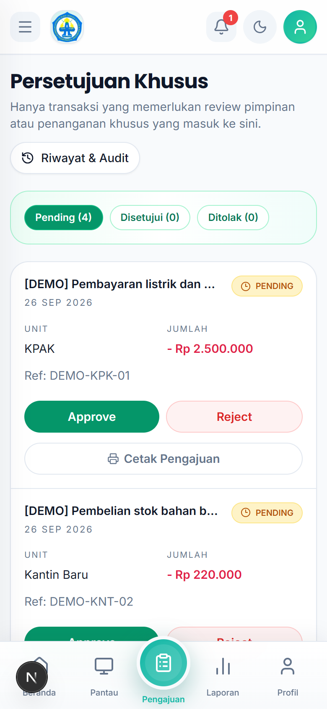
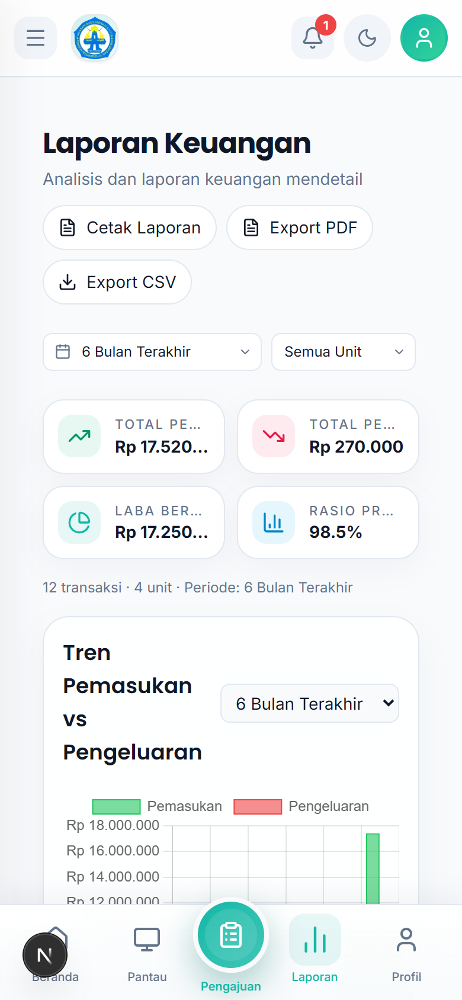
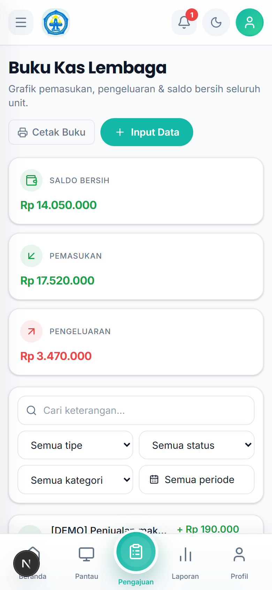

# Tutorial — Pimpinan Lembaga

Akun: `pimpinan@alba.app` / `bismillah`

## 1. Cara Login

1. Buka aplikasi di browser HP.
2. Isi **Email** `pimpinan@alba.app` dan **Password** `bismillah`.
3. Ketuk **Masuk**. Anda masuk ke **Dashboard Eksekutif**.

## 2. Membaca Dashboard Eksekutif

Setelah login tampil grid jalan pintas (Input Data, Buku Kas, Papan Pantau, Laporan, Pengumuman, Persetujuan, Unit, Kategori, Pegawai, Belanja), kartu **Menunggu Persetujuan**, dan ringkasan **Total Saldo**.

## 3. Menyetujui / Menolak Pengajuan

1. Dari dashboard, ketuk **Persetujuan** (atau menu bawah **Pengajuan**).
2. Buka tab **Pending** untuk melihat antrean.
3. Ketuk satu pengajuan untuk membaca rincian (nominal, keperluan, pengaju, unit).
4. Ketuk **Setujui** untuk meloloskan, atau **Tolak** (wajib isi alasan).

## 4. Melihat Laporan

1. Ketuk **Laporan** di dashboard.
2. Pilih periode dan unit untuk melihat rekap pemasukan, pengeluaran, dan saldo.

## 5. Memeriksa Buku Kas

1. Ketuk **Buku Kas**.
2. Saring per unit, kategori, atau tanggal untuk menelusuri transaksi.

## 6. Rutinitas Harian (5 menit)

1. Buka dashboard — lihat kartu **Menunggu Persetujuan**.
2. Habiskan antrean Pending (setujui/tolak + alasan).
3. Cek **Total Saldo** dan **Hari Ini** untuk denyut kas harian.
