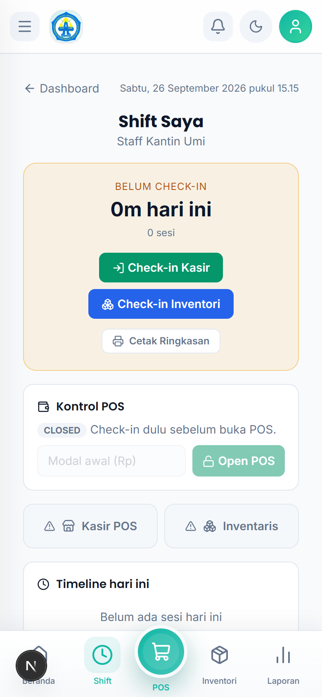
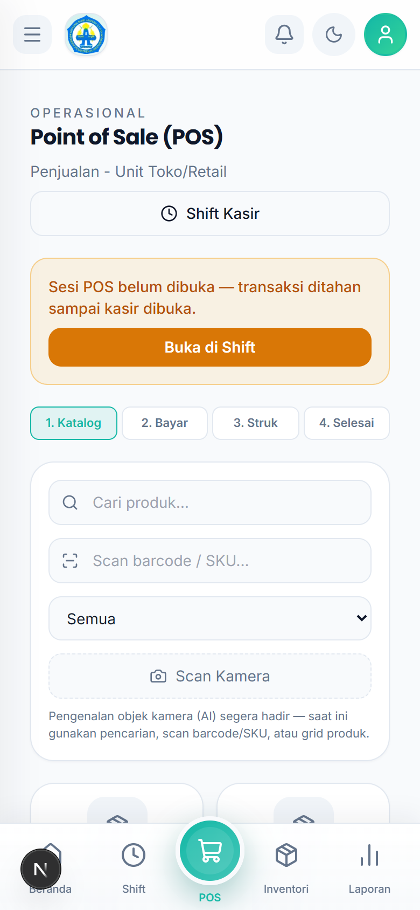
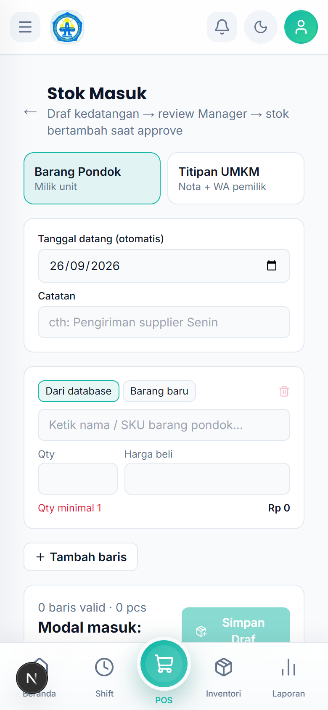
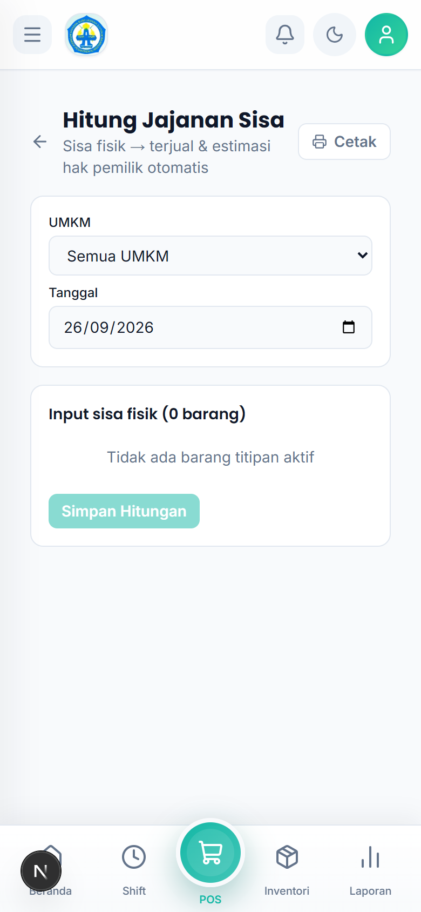
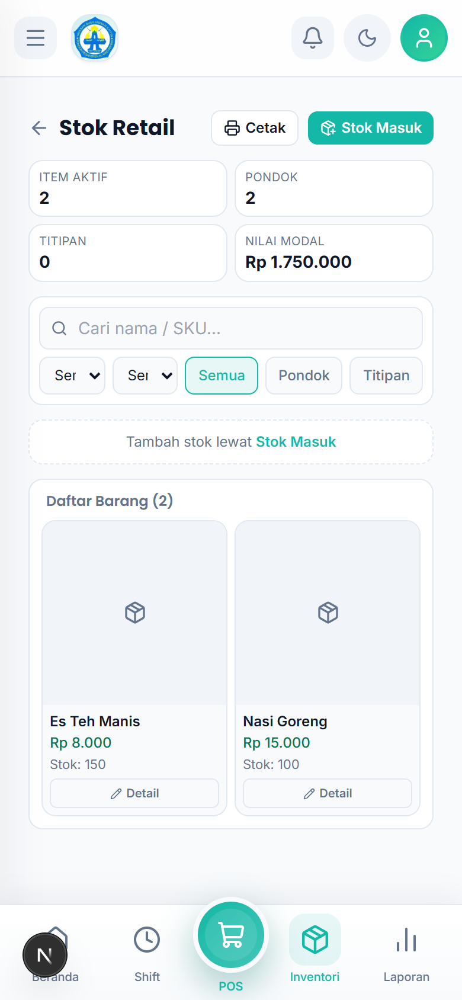

# Tutorial — Staff Kantin Umi

Akun: `staff.kantinumi@alba.app` / `bismillah`

## 1. Cara Login

1. Buka aplikasi di browser HP.
2. Isi **Email** `staff.kantinumi@alba.app` dan **Password** `bismillah`.
3. Ketuk **Masuk**.

## 2. Memulai Shift (wajib pertama)

1. Buka `Retail Saya → Shift Saya`.
2. Ketuk **Check-in Kasir** dan/atau **Check-in Inventori**.
3. Isi **kas awal/modal** untuk membuka Shift Kasir.
4. Akhiri dengan **Check-out**.

## 3. Membuka & Melayani POS

1. Buka `Toko → POS` (sudah check-in + Shift Kasir terbuka).
2. **Katalog** — cari/ketik nama atau **scan barcode**, masukkan ke keranjang.
3. **Bayar** — tunai (**Bayar**) atau kartu santri (**Bayar dengan Kartu**).
4. **Struk** — cek + **Cetak Struk** bila diminta.
5. **Selesai** — tercatat di penjualan hari ini.

## 4. Menambah Barang (Stok Masuk)

1. Buka `Retail Saya → Stok Masuk`.
2. Pilih **Barang Pondok** (milik unit) atau **Titipan UMKM** (butuh data pemilik + No. WA).
3. Isi tanggal datang + catatan, lalu per baris pilih **Dari database** atau **Barang baru**, isi **Qty** dan **Harga beli** (**+ Tambah baris** bila banyak).
4. Ketuk **Simpan Draf** — status **draf**, menunggu persetujuan manager.

## 5. Menghitung Sisa

1. Buka `Retail Saya → Hitung Sisa`.
2. Isi sisa fisik tiap barang → **Simpan Hitungan**.
3. Menunggu persetujuan manager untuk selaras otomatis.

## 6. Melihat Stok & Belanja

- `Retail Saya → Stok` — cek persediaan Kantin Umi.
- `Retail Saya → Belanja` — catat kebutuhan belanja.

## 7. Rutinitas Harian

1. Login → **Shift Saya** → check-in (+ buka Shift Kasir).
2. Tugas: POS / Stok Masuk / Hitung Sisa.
3. **Check-out** saat pulang.
