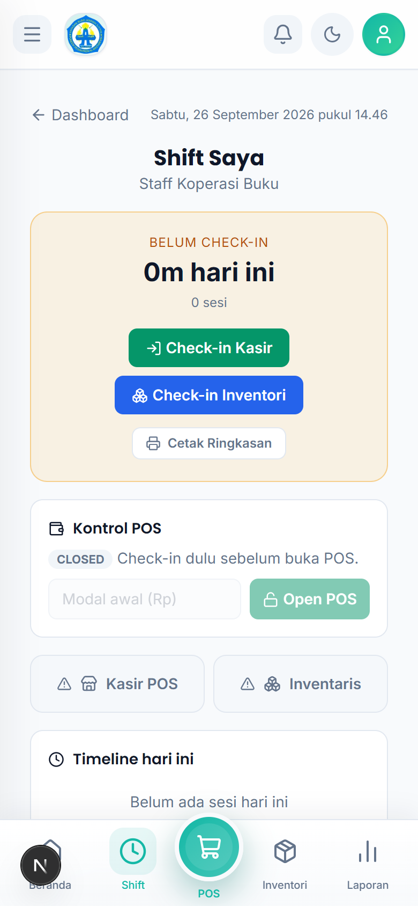
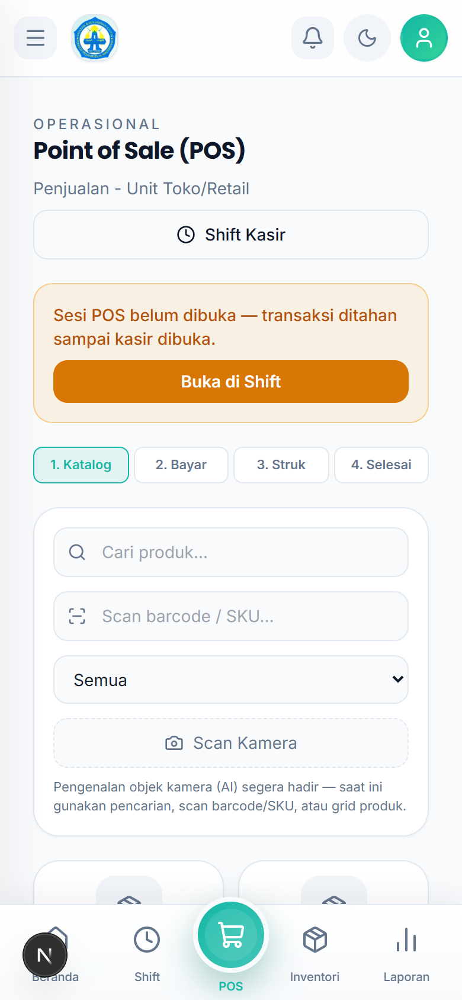
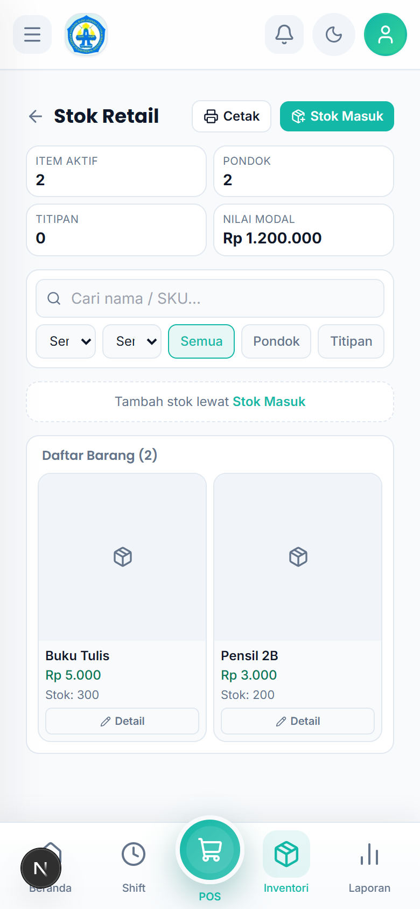

# Tutorial — Staff Koperasi Buku

Akun: `staff.koperasi@alba.app` / `bismillah`

## 1. Cara Login

1. Buka aplikasi di browser HP.
2. Isi **Email** `staff.koperasi@alba.app` dan **Password** `bismillah`.
3. Ketuk **Masuk**.

## 2. Memulai Shift (wajib pertama)

1. Buka `Retail Saya → Shift Saya`.
2. Ketuk **Check-in Kasir** (untuk jaga kasir) dan/atau **Check-in Inventori** (untuk urus stok).
3. Untuk membuka laci kasir: isi **kas awal/modal** → POS dibuka.
4. Di akhir kerja ketuk **Check-out**.

## 3. Membuka & Melayani POS

1. Buka `Toko → POS` (pastikan sudah check-in + Shift Kasir terbuka).
2. **Langkah 1 — Katalog**: cari produk (ketik nama atau **Scan barcode/SKU**), ketuk barang untuk masuk keranjang.
3. **Langkah 2 — Bayar**: tunai via **Bayar** (isi Uang Bayar, cek kembalian) atau kartu santri via **Bayar dengan Kartu**.
4. **Langkah 3 — Struk**: periksa rincian, **Cetak Struk** bila diminta.
5. **Langkah 4 — Selesai**: transaksi tercatat di penjualan hari ini.

## 4. Menambah Barang (Stok Masuk)

> Menu "Tambah Barang" lama sudah digabung ke wizard **Stok Masuk**.

1. Buka `Retail Saya → Stok Masuk`.
2. Pilih jenis barang:
   - **Barang Pondok** — milik unit.
   - **Titipan UMKM** — butuh data pemilik + No. WA aktif (terbit Nota Titipan).
3. Isi tanggal datang + catatan, lalu per baris barang pilih **Dari database** (ketik nama/SKU) atau **Barang baru**, isi **Qty** dan **Harga beli**. Tambah baris via **+ Tambah baris**.
4. Ketuk **Simpan Draf**. Catatan berstatus **draf** — harus disetujui manager (Review Stok Masuk) sebelum resmi jadi stok.

## 5. Menghitung Sisa (stok opname)

1. Buka `Retail Saya → Hitung Sisa`.
2. Isi **sisa fisik** tiap barang yang dihitung.
3. Ketuk **Simpan Hitungan** → "Hitungan tersimpan · menunggu persetujuan Manager".
4. Manager menyetujui → stok diselaraskan otomatis.

## 6. Melihat Stok & Belanja

- `Retail Saya → Stok` — cek persediaan.
- `Retail Saya → Belanja` — catat kebutuhan belanja untuk diajukan.

## 7. Rutinitas Harian

1. Login → **Shift Saya** → check-in (+ buka Shift Kasir bila jaga kasir).
2. Layani POS / input Stok Masuk / Hitung Sisa sesuai tugas.
3. **Check-out** setiap pulang.
