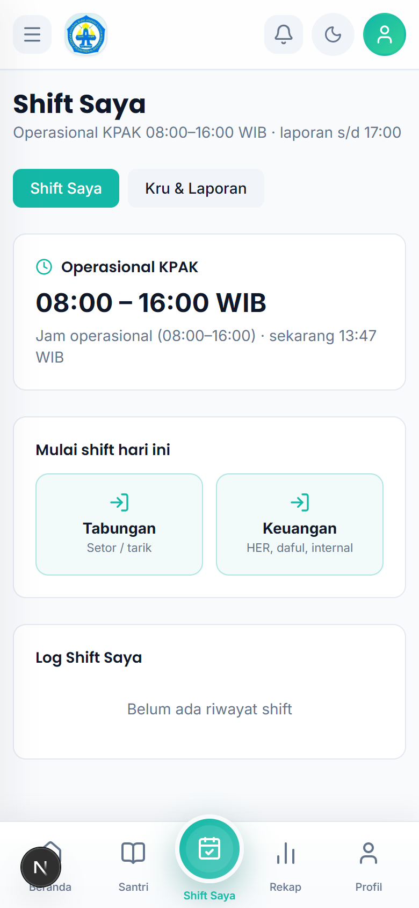
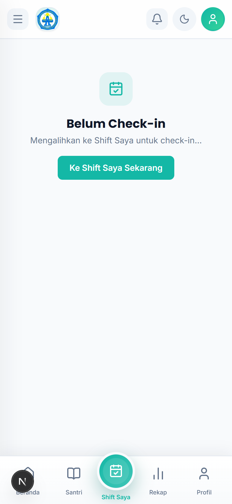
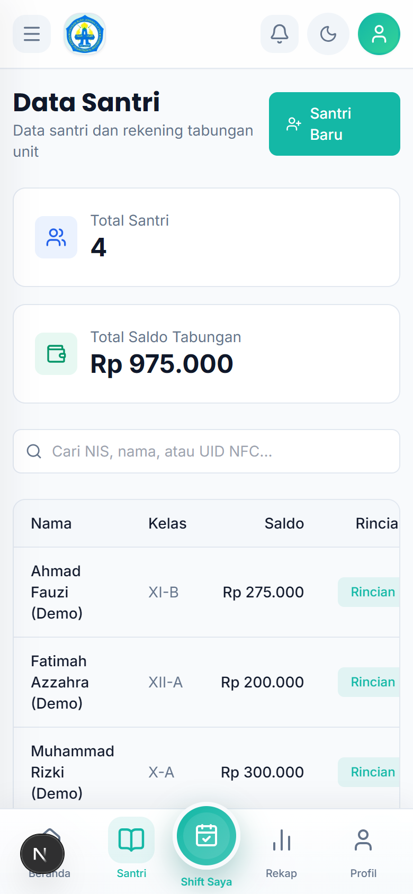

# Tutorial — Staff KPAK

Akun: `staff.kpak@alba.app` / `bismillah`

## 1. Cara Login

1. Buka aplikasi di browser HP.
2. Isi **Email** `staff.kpak@alba.app` dan **Password** `bismillah`.
3. Ketuk **Masuk**.

## 2. Check-in Shift + Pilih Layanan (wajib pertama)

1. Buka `Layanan KPAK → Shift Saya`.
2. Ketuk **Mulai shift hari ini**, lalu pilih layanan:
   - **Check-in Tabungan** — untuk melayani setoran/penarikan tabungan santri.
   - **Check-in Keuangan** — untuk melayani pembayaran administrasi.
3. "Check-in tercatat — selamat bertugas". Anda **langsung diantar** ke halaman layanan.
4. Tanpa check-in, menu Tabungan & Keuangan **terkunci**.
5. Pindah layanan tanpa checkout via tombol **Ganti ke Tabungan/Keuangan**.

## 3. Melayani Tabungan Santri

1. Pastikan shift layanan **Tabungan** aktif.
2. Cari santri dengan **NIS/Nomor santri**, ketuk **Cari**.
3. Untuk setoran: isi nominal → **Simpan Setoran**. Untuk penarikan tunai: isi nominal → simpan (diambil langsung di loket).
4. Santri baru? Ketuk **Santri Baru** / **Simpan Santri** (atau daftarkan dulu di Data Santri).
5. Bisa **Cetak Kartu Tabungan** sebagai bukti.

## 4. Melayani Pembayaran Administrasi (Layanan Keuangan)

1. Pastikan shift layanan **Keuangan** aktif.
2. Buka `Layanan KPAK → Layanan Keuangan`.
3. Pilih jenis (mis. HER/SPP, Daftar Ulang), isi **Nominal (Rp)** dan **Keterangan** (mis. "HER September").
4. Ketuk **Catat Pembayaran**. Status: "Pembayaran tercatat — menunggu persetujuan".

## 5. Mencari Data Santri

1. Buka `Data KPAK → Data Santri`.
2. Cari nama/NIS untuk keperluan verifikasi layanan.

## 6. Check-out + Laporan Shift

1. Kembali ke `Shift Saya` di akhir tugas.
2. Kirim **Laporan shift** ke manager (agar bisa diterima di Perlu Keputusan).
3. Ketuk **Check-out**. "Check-out tercatat — terima kasih".

## 7. Rutinitas Harian

1. Login → **Shift Saya** → check-in + pilih layanan.
2. Layani sesuai antrean (Tabungan / Keuangan).
3. Kirim laporan shift → **Check-out**.
